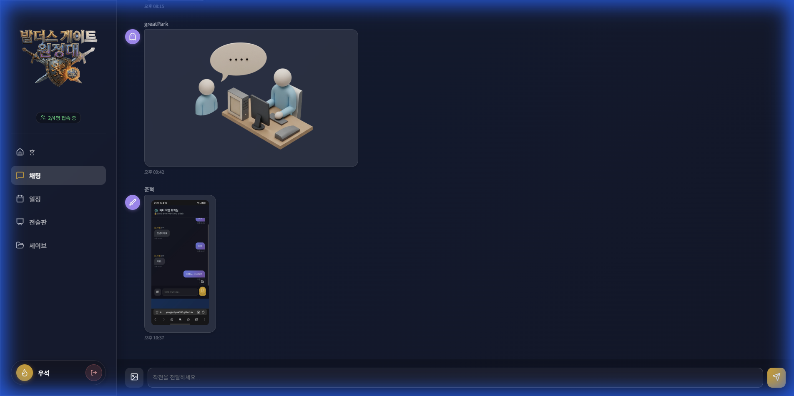
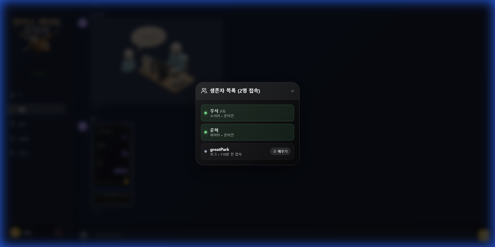
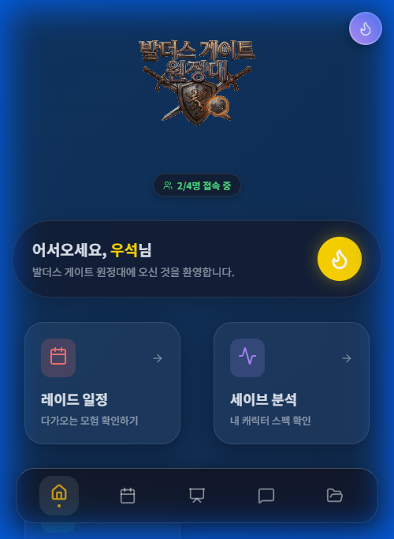

# 🗡️ 발더스 게이트 3 원정대 관리자 (BG3 Raid Manager)

팀원들과의 일정 조율, 실시간 전술 수립, 그리고 생존 확인까지.
발더스 게이트 3 고정팟(공대) 운영을 위한 올인원 대시보드입니다.

🔗 **배포 링크**: [https://yangjunhyuk333.github.io/bg3-raid-manager](https://yangjunhyuk333.github.io/bg3-raid-manager)

---

## ✨ 주요 기능

*   **📅 레이드 스케줄러**: 팀원들의 시간표를 겹쳐서 최적의 시간을 찾아줍니다.
*   **⚔️ 실시간 전술판**: 화이트보드처럼 자유롭게 전략을 짜고, 파티원 위치를 지정하고, 영상을 공유하세요.
*   **💬 실시간 채팅**: 작전 회의를 위한 전용 채팅방.
*   **🔔 생존 확인 (Wake Up)**: 늦잠 자는 공대원을 깨우는 알람 기능.
*   **📁 세이브 파일 분석**: 세이브 파일을 업로드하여 진행도를 공유하세요.

---

## 🖥️ Web Experience (Desktop)

PC 환경에서는 넓은 화면을 활용한 쾌적한 작전 수립이 가능합니다.

### 1. 홈 대시보드
한눈에 들어오는 공지사항, 다가오는 일정, 그리고 최근 전술 목록.

### 2. 전술 작전실 (Tactics Board)
실시간으로 동기화되는 전술판입니다. 펜, 텍스트, 캐릭터 토큰(직업 아이콘), 유튜브 영상을 활용하세요.

### 3. 일정 관리 (Scheduler)
가능한 시간을 드래그하면 교집합 구간을 자동으로 표시해줍니다.

### 4. 실시간 채팅

### 5. 생존자 명단 (Presence)
현재 접속 중인 인원 확인 및 '깨우기' 알림 발송.

---

## 📱 App Experience (Mobile)

모바일에서도 PWA(앱)로 설치하여 편리하게 사용할 수 있습니다.

### 1. 모바일 홈
주요 기능에 빠르게 접근할 수 있는 카드형 UI와 하단 네비게이션.

### 2. 모바일 채팅
이동 중에도 놓치지 않는 작전 회의.

### 3. 프로필 관리
자신의 직업(클래스)과 색상을 설정하여 개성을 표현하세요.

---

## 🛠️ Tech Stack

*   **Frontend**: React, Vite
*   **Backend**: Firebase (Firestore - Realtime DB)
*   **Hosting**: GitHub Pages
*   **Features**: PWA Support, Touch Gestures, Youtube Embed

---

Created by YangJunHyuk.
Let's get that Honor Mode! 🎲
